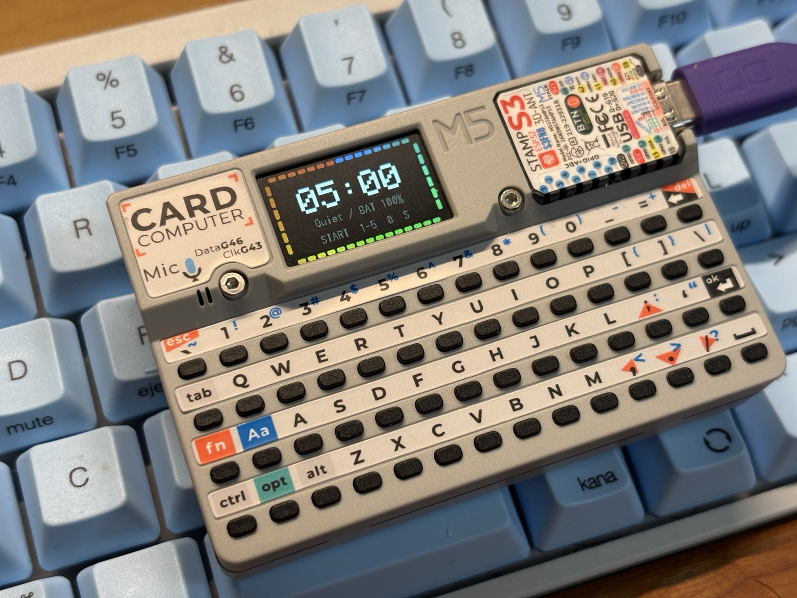
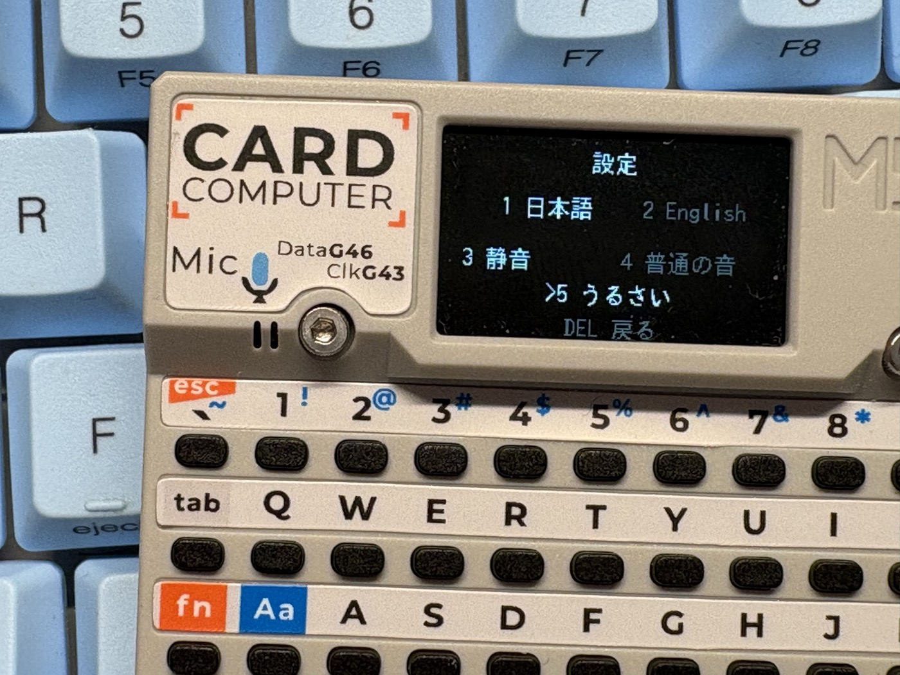

# CARDPUTER StudyTimer

M5Stack Cardputer 向けの、落ち着いて使えるシンプルな学習タイマーです。



このアプリの主役はタイマーで、ログは自動で残る補助機能です。想定している日常の流れは次のとおりです。

```text
電源オン
前回のタイマーが表示される
Enter を押す
学習開始
```

## コンセプト

CARDPUTER StudyTimer は、いわゆる生産性アプリではなく、100 円ショップのキッチンタイマーのように気軽に使える体験を目指しています。

あえて単体完結の設計にしています。

- Cardputer 単体で完結
- 追加 UNIT モジュール不要
- MQTT 不要
- Home Assistant 連携なし
- クラウド機能なし
- ゲーミフィケーションなし
- 科目名入力なし

Wi-Fi と NTP は、必要な場合だけ裏で動く補助機能です。Wi-Fi 接続、NTP 同期、SD へのログ保存のいずれかに失敗しても、タイマー自体は問題なく使えます。

## 機能

- 前回設定した時間をすぐ表示する高速起動
- プリセット: 5 / 10 / 15 / 25 / 45 分
- 1 〜 99 分の手動入力
- 大きな残り時間表示
- 画面四辺のセグメントによる進捗表示
- 日本語 / 英語 UI
- サウンドモード: 静音 / 普通の音 / うるさい
- 非充電時にバッテリー残量 20% 以下で視覚警告
- 完了セッションを microSD の CSV に自動記録
- バックグラウンドでの Wi-Fi / NTP 時刻同期
- 起動時に Wi-Fi や NTP を待たない

## 操作

### 待機状態

- `Enter`: 前回設定のタイマーを開始
- `1` 〜 `5`: プリセット開始
- `0`: カスタム時間入力へ
- `S`: 設定を開く
- `L`: 記録を開く
- `V`: ボイスメモ一覧を開く
- `M` 長押し: ボイスメモを録音（どの画面でも使用可能）

### カスタム入力

- 数字キー: 分を入力
- `Enter`: 開始
- `Del`: 1 桁削除（空の状態で押すと待機状態に戻る）

### 実行中 / 一時停止中

- `Enter`: 一時停止 / 再開
- `Del`: リセット確認画面を開く

### 設定

`S` で言語の設定を開き、`Fn + /` と `Fn + ;` で言語の設定と音量の設定を切り替えます。

言語の設定:

- `1`: 日本語
- `2`: 英語

音量の設定:

- `1`: 静音
- `2`: 普通の音
- `3`: うるさい

操作:

- `Fn + ;`: 左へ移動
- `Fn + ,`: 下へ移動
- `Fn + .`: 上へ移動
- `Fn + /`: 右へ移動
- `Enter`: 選択項目を適用
- `Del`: 待機状態に戻る



### 記録

`L` で SD カード上の `study_log.csv` から記録を表示します。

- 今日の合計
- 直近7日間の合計
- 連続日数
- 最近7日の簡易バー

NTP 同期済みの場合は正確な日付で集計します。NTP 同期前でも、過去に同期した日付が保存されていれば `OFFLINE DATE` / `オフライン日付` として仮の日付で集計します。SD カードが使えない場合は記録表示は待機状態になります。

### ボイスメモ

`M` を長押ししている間、内蔵マイクからボイスメモを録音します。録音中もタイマーは止まりません。録音データは SD カードの `/voice_memos/` に WAV ファイルとして保存されます。

- `M` 長押し: 録音
- `M` を離す: 保存
- `V`: ボイスメモ一覧を開く
- `Fn + ;`: 前のメモ
- `Fn + /`: 次のメモ
- `Enter`: 再生 / 停止
- `Del`: 戻る

時刻同期済みの場合は日時ファイル名、未同期の場合は連番ファイル名で保存します。

## 設定ファイル

`config.example.h` を `config.h` としてコピーし、編集は `config.h` だけに行ってください。

```cpp
#define WIFI_ENABLED true
#define WIFI_SSID ""
#define WIFI_PASSWORD ""

#define NTP_SERVER_1 "pool.ntp.org"
#define NTP_SERVER_2 "time.google.com"
#define NTP_SERVER_3 "time.cloudflare.com"
#define GMT_OFFSET_SECONDS 32400
#define DAYLIGHT_OFFSET_SECONDS 0
```

実際の Wi-Fi 認証情報はコミットしないでください。`config.h` は .gitignore で除外されています。

Wi-Fi を設定していなくてもタイマーは動作します。過去に時刻同期済みなら完了セッションは `offline` として日付つきで記録され、日付が分からない場合は `unsynced` として記録されます。

## CSV ログ

完了したセッションは次のファイルに追記されます。

```text
/study_log.csv
```

現在の CSV 形式は次のとおりです。

```csv
date,time,sync_status,duration_min,completed,input_type
2026-05-19,13:32:52,synced,25,1,preset4
2026-05-19,14:10:12,synced,45,1,custom
2026-05-19,,offline,25,1,preset4
,,unsynced,15,1,preset3
```

各列の意味:

- `date`: `YYYY-MM-DD`（日付不明時は空）
- `time`: `HH:MM:SS`（NTP 未同期時は空）
- `sync_status`: `synced`、`offline`、または `unsynced`
- `duration_min`: タイマー時間（分単位）
- `completed`: 完了セッションは `1`
- `input_type`: `preset1` 〜 `preset5`、または `custom`

日時を 1 つのタイムスタンプ文字列にまとめず分割しているのは、将来的に Cardputer 上で日次集計をしやすくするためです。

## ビルド

対象ボード:

```text
m5stack:esp32:m5stack_cardputer
```

必要な Arduino ライブラリ:

- M5Cardputer
- M5Unified
- M5GFX

コンパイルコマンド例:

```bash
arduino-cli compile --fqbn m5stack:esp32:m5stack_cardputer .
```

## リポジトリ内容

この公開向けリポジトリでは、意図的に次のファイルだけを追跡しています。

- `CARDPUTER-StudyTimer.ino`
- `README.md`
- `README.ja.md`
- `LICENSE`
- `config.example.h`
- `images/`
- `.gitignore`

ローカルメモ、自動生成ドキュメント、個人用設定、エディタ関連ファイルは追跡対象外です。

## AI 利用について

このプロジェクトの開発では、Codex app や GitHub Copilot などの AI ツールを活用しています。

## ライセンス

このプロジェクトは MIT License のもとで公開されています。

Copyright (c) 2026 omiya-bonsai
